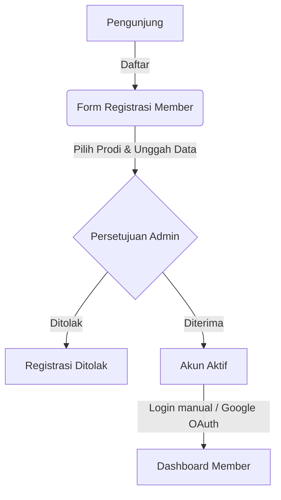

# Penjelasan Proyek: LibraFlow (Sistem Manajemen Perpustakaan)

Dokumentasi ini menjelaskan arsitektur, alur kerja (flow), dan penjelasan fungsionalitas dari setiap file dalam proyek **LibraFlow**, sistem manajemen perpustakaan modern berbasis Laravel.

---

## 🗺️ Alur Kerja Utama (Workflow)

Proyek ini memiliki dua sisi utama: **Sisi Publik & Member** (untuk pembaca) dan **Sisi Workspace Staff & Admin** (untuk pustakawan dan administrator).

### 1. Flow Registrasi & Login Member

* **Registrasi:** Pendaftaran meminta nama, email, pilihan Program Studi (Branch), angkatan, kategori member, serta foto bukti identitas/kartu mahasiswa. Akun yang terdaftar berstatus *pending* sampai diverifikasi staff.
* **Verifikasi:** Administrator/Pustakawan meninjau pengajuan di menu Approvals dan menyetujui/menolak.
* **OAuth Login:** Login member mendukung Google Sign-In menggunakan Laravel Socialite.

### 2. Flow Peminjaman Buku Fisik (Circulation)
* Peminjaman dan pengembalian dilakukan secara manual di meja sirkulasi oleh Staff.
* Staff memasukkan **Kode Member** (`member_code`) dan **Kode Buku** (`copy_code`).
* Sistem memvalidasi apakah member melebihi limit peminjaman kategori mereka atau memiliki keterlambatan aktif. Jika lolos, buku berstatus `STATUS_BORROWED` dan transaksi dibuat.

### 3. Flow E-Book Reader (Digital Reading)
* Buku digital (PDF) diunggah oleh Admin dan disimpan langsung ke **AWS S3** (`digital-books/{uuid}/original.pdf`).
* Saat member mengklik *Read*, sistem membuat `ReadingSession` baru.
* PDF tidak diunduh langsung oleh client, melainkan dirender halaman demi halaman di sisi server menggunakan pipeline khusus (`NodePdfPageRenderer` dan watermarking) untuk mencegah plagiarisme/download ilegal.
* Client mengirimkan *heartbeat* secara periodik untuk memperbarui data waktu baca (reading duration).

---

## 📂 Penjelasan Struktur dan File Proyek

Berikut adalah daftar file utama di bawah direktori `app/` dan penjelasannya masing-masing.

### 1. 🗄️ Model (`app/Models`)

Setiap model merepresentasikan satu tabel di database dengan relasi antartabel yang ditentukan secara spesifik:

* **[Book.php](file:///d:/Rezza/Self%20Project/library-management/app/Models/Book.php):** Representasi data buku secara global (Judul, Penulis, ISBN, Penerbit, Cover Image). Terhubung dengan `BookCategory` dan memiliki banyak `BookCopy`.
* **[BookCategory.php](file:///d:/Rezza/Self%20Project/library-management/app/Models/BookCategory.php):** Kategori buku (e.g. Technology, Science, Fiction) lengkap dengan warna representatif untuk UI dan slug.
* **[BookCopy.php](file:///d:/Rezza/Self%20Project/library-management/app/Models/BookCopy.php):** Merepresentasikan buku fisik secara spesifik (setiap buku bisa memiliki beberapa salinan/kopi fisik). Memiliki `copy_code` unik, letak rak (`shelf_location`), dan status (Available, Borrowed, Lost).
* **[BorrowTransaction.php](file:///d:/Rezza/Self%20Project/library-management/app/Models/BorrowTransaction.php):** Mencatat transaksi peminjaman fisik. Menyimpan relasi ke buku kopi, member, staff yang melayani peminjaman, tanggal jatuh tempo, dan tanggal pengembalian.
* **[Branch.php](file:///d:/Rezza/Self%20Project/library-management/app/Models/Branch.php):** Program Studi/Jurusan member perpustakaan (e.g. Informatika, Sistem Informasi).
* **[DigitalBookAsset.php](file:///d:/Rezza/Self%20Project/library-management/app/Models/DigitalBookAsset.php):** Data e-book yang terhubung dengan `Book`. Menyimpan info enkripsi file e-book di AWS S3, hash SHA-256 untuk integritas, dan jumlah halaman (`page_count`).
* **[Member.php](file:///d:/Rezza/Self%20Project/library-management/app/Models/Member.php):** Data detail profil member perpustakaan.
* **[MemberCategory.php](file:///d:/Rezza/Self%20Project/library-management/app/Models/MemberCategory.php):** Mengatur limitasi pinjam buku berdasarkan tipe member (e.g. Mahasiswa reguler bisa pinjam max 3 buku selama 14 hari, sedangkan Dosen/Peneliti bisa lebih).
* **[ReadingSession.php](file:///d:/Rezza/Self%20Project/library-management/app/Models/ReadingSession.php):** Sesi membaca e-book aktif. Menyimpan informasi halaman terakhir yang dibaca, durasi baca, IP address, user agent, dan status pembacaan.
* **[User.php](file:///d:/Rezza/Self%20Project/library-management/app/Models/User.php):** Data staff perpustakaan (Administrator dan Librarian). Menggunakan guard otentikasi admin standar.

---

### 2. 🎮 Controller (`app/Http/Controllers`)

Bertanggung jawab memproses input request, berinteraksi dengan service layer, dan mengembalikan response/view.

#### Sisi Publik & Member
* **[MemberAuthController.php](file:///d:/Rezza/Self%20Project/library-management/app/Http/Controllers/MemberAuthController.php):** Menangani alur login, otentikasi, dan logout khusus member.
* **[MemberRegistrationController.php](file:///d:/Rezza/Self%20Project/library-management/app/Http/Controllers/MemberRegistrationController.php):** Memproses registrasi awal bagi calon member baru.
* **[MemberProfileController.php](file:///d:/Rezza/Self%20Project/library-management/app/Http/Controllers/MemberProfileController.php):** Memungkinkan member untuk melihat serta mengupdate kelengkapan profil mereka sendiri.
* **[MemberReaderController.php](file:///d:/Rezza/Self%20Project/library-management/app/Http/Controllers/MemberReaderController.php):** Controller utama untuk interaksi membaca e-book. Melayani in-app PDF reader halaman per halaman dengan sistem pengamanan *heartbeat* pencegah pembajakan.
* **[PublicBookController.php](file:///d:/Rezza/Self%20Project/library-management/app/Http/Controllers/PublicBookController.php):** Menangani halaman utama pencarian katalog publik bagi pengunjung luar maupun member.
* **[SocialiteController.php](file:///d:/Rezza/Self%20Project/library-management/app/Http/Controllers/SocialiteController.php):** Mengintegrasikan login member secara instan melalui Google OAuth (Google Sign-In).

#### Sisi Workspace Staff & Admin (Prefix `/admin`)
* **[DashboardController.php](file:///d:/Rezza/Self%20Project/library-management/app/Http/Controllers/DashboardController.php):** Menampilkan ringkasan data statistik (jumlah sirkulasi aktif, buku paling populer, pengajuan member tertunda).
* **[BookController.php](file:///d:/Rezza/Self%20Project/library-management/app/Http/Controllers/BookController.php):** CRUD data Buku Global perpustakaan. Mendukung input data buku secara opsional sekaligus mengunggah cover image ke AWS S3.
* **[BookCopyController.php](file:///d:/Rezza/Self%20Project/library-management/app/Http/Controllers/BookCopyController.php):** Mengelola salinan fisik (kopi) buku spesifik untuk diposisikan di rak tertentu.
* **[BookCategoryController.php](file:///d:/Rezza/Self%20Project/library-management/app/Http/Controllers/BookCategoryController.php):** CRUD klasifikasi kategori buku.
* **[CirculationController.php](file:///d:/Rezza/Self%20Project/library-management/app/Http/Controllers/CirculationController.php):** Layanan transaksi sirkulasi buku (Pinjam & Kembali) yang digunakan oleh staff.
* **[MemberController.php](file:///d:/Rezza/Self%20Project/library-management/app/Http/Controllers/MemberController.php):** Menu pengelolaan data member perpustakaan dan approval (persetujuan) akun pendaftaran baru.
* **[TransactionController.php](file:///d:/Rezza/Self%20Project/library-management/app/Http/Controllers/TransactionController.php):** Riwayat seluruh transaksi sirkulasi perpustakaan.
* **[ReportController.php](file:///d:/Rezza/Self%20Project/library-management/app/Http/Controllers/ReportController.php):** Ekspor laporan sirkulasi dan katalog ke format Excel/CSV.
* **[AuthController.php](file:///d:/Rezza/Self%20Project/library-management/app/Http/Controllers/AuthController.php):** Otentikasi masuk dan keluar untuk staff perpustakaan.

#### Sub-Folder Admin (`app/Http/Controllers/Admin`)
* **[DigitalBookController.php](file:///d:/Rezza/Self%20Project/library-management/app/Http/Controllers/Admin/DigitalBookController.php):** Penanganan upload PDF e-book secara spesifik ke dalam buku global yang sudah ada (Admin Only).
* **[ReadingHistoryController.php](file:///d:/Rezza/Self%20Project/library-management/app/Http/Controllers/Admin/ReadingHistoryController.php):** Pelacakan aktivitas membaca member secara riil untuk keperluan audit (Admin Only).

---

### 3. ⚙️ Service Layer (`app/Services`)

Layer bisnis logika (business logic) terpisah yang menjaga agar Controller tetap ramping (*thin controller*).

* **[BookService.php](file:///d:/Rezza/Self%20Project/library-management/app/Services/BookService.php):** Bisnis logika pembuatan buku baru, manajemen upload gambar cover ke S3, sinkronisasi relasi kategori, dan penghapusan cover lama dari S3 jika diganti.
* **[CirculationService.php](file:///d:/Rezza/Self%20Project/library-management/app/Services/CirculationService.php):** Bisnis logika di balik transaksi sirkulasi. Memvalidasi batasan member, menghitung denda keterlambatan, mengubah status salinan buku, dan mencatatnya ke database.
* **[DigitalBookService.php](file:///d:/Rezza/Self%20Project/library-management/app/Services/DigitalBookService.php):** Mengelola upload file PDF mentah secara aman ke AWS S3, menghitung jumlah halaman PDF asli, serta menginisiasi penghapusan berkas dari S3 jika aset digital dihapus.
* **[ReadingSessionService.php](file:///d:/Rezza/Self%20Project/library-management/app/Services/ReadingSessionService.php):** Membuka sesi membaca e-book baru, memvalidasi progres pembacaan, dan memproses heartbeat periodik untuk mencatat waktu aktif membaca member.
* **[ReportService.php](file:///d:/Rezza/Self%20Project/library-management/app/Services/ReportService.php):** Mengompilasi data mentah dari database menjadi metrik laporan analitis yang siap diekspor.
* **[NodePdfPageRenderer.php](file:///d:/Rezza/Self%20Project/library-management/app/Services/NodePdfPageRenderer.php):** Memanfaatkan skrip Node.js (via `pdfjs-dist`) untuk merender halaman PDF tertentu menjadi gambar (PNG) berkualitas tinggi di backend.
* **[NodePageWatermarker.php](file:///d:/Rezza/Self%20Project/library-management/app/Services/NodePageWatermarker.php):** Memberikan watermark dinamis secara backend (nama member, email, IP Address, timestamp) di atas halaman buku digital yang telah dirender untuk mencegah pembajakan/screenshot ilegal.
* **[MemberService.php](file:///d:/Rezza/Self%20Project/library-management/app/Services/MemberService.php):** Menangani proses approval pendaftaran member serta perubahan status keaktifannya.

---

### 4. 🔀 Routing (`routes`)

* **[web.php](file:///d:/Rezza/Self%20Project/library-management/routes/web.php):** Mendefinisikan seluruh endpoint URL aplikasi, dipisahkan berdasarkan grup middleware:
  - `guest:member` untuk pendaftaran/login member.
  - `auth:member` untuk akses in-app reader & dashboard profil.
  - `auth` & `staff.active` untuk workspace admin/staff.
  - Middleware khusus `admin.only` untuk fungsi krusial e-book upload dan audit membaca.
