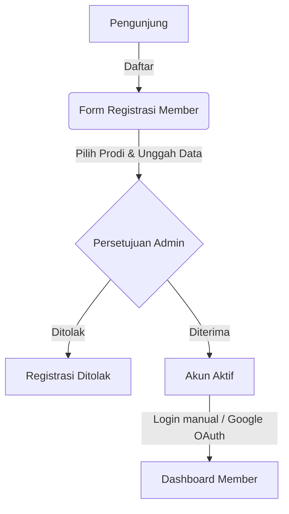

# Penjelasan Proyek: LibraFlow (Sistem Manajemen Perpustakaan)

Dokumentasi ini menjelaskan arsitektur, alur kerja (flow), dan penjelasan fungsionalitas dari setiap file dalam proyek **LibraFlow**, sistem manajemen perpustakaan modern berbasis Laravel.

---

## 🗺️ Alur Kerja Utama (Workflow)

Proyek ini memiliki dua sisi utama: **Sisi Publik & Member** (untuk pembaca) dan **Sisi Workspace Staff & Admin** (untuk pustakawan dan administrator).

### 1. Flow Registrasi & Login Member

* **Registrasi:** Pendaftaran meminta nama, email, pilihan Program Studi (Branch), angkatan, kategori member, serta foto bukti identitas/kartu mahasiswa. Akun yang terdaftar berstatus *pending* sampai diverifikasi staff.
* **Verifikasi:** Administrator/Pustakawan meninjau pengajuan di menu Approvals dan menyetujui/menolak.
* **OAuth Login:** Login member mendukung Google Sign-In menggunakan Laravel Socialite.

### 2. Flow Peminjaman Buku Fisik (Circulation)
* Peminjaman dan pengembalian dilakukan secara manual di meja sirkulasi oleh Staff.
* Staff memasukkan **Kode Member** (`member_code`) dan **Kode Buku** (`copy_code`).
* Sistem memvalidasi apakah member melebihi limit peminjaman kategori mereka atau memiliki keterlambatan aktif. Jika lolos, buku berstatus `STATUS_BORROWED` dan transaksi dibuat.

### 3. Flow E-Book Reader (Digital Reading)
* Buku digital (PDF) diunggah oleh Admin dan disimpan langsung ke **AWS S3** (`digital-books/{uuid}/original.pdf`).
* Saat member mengklik *Read*, sistem membuat `ReadingSession` baru.
* Laravel melakukan streaming PDF asli melalui endpoint privat yang hanya dapat diakses pemilik sesi baca.
* PDF.js di browser merender satu halaman pada satu waktu ke canvas. Tombol **Sebelumnya** dan **Berikutnya** mengganti halaman tanpa membuat PNG di server.
* Client mengirimkan *heartbeat* secara periodik untuk memperbarui data waktu baca (reading duration).

---

## 📂 Penjelasan Struktur dan File Proyek

Berikut adalah daftar file utama di bawah direktori `app/` dan penjelasannya masing-masing.

### 1. 🗄️ Model (`app/Models`)

Setiap model merepresentasikan satu tabel di database dengan relasi antartabel yang ditentukan secara spesifik:

* **[Book.php](file:///d:/Rezza/Self%20Project/library-management/app/Models/Book.php):** Representasi data buku secara global (Judul, Penulis, ISBN, Penerbit, Cover Image). Terhubung dengan `BookCategory` dan memiliki banyak `BookCopy`.
* **[BookCategory.php](file:///d:/Rezza/Self%20Project/library-management/app/Models/BookCategory.php):** Kategori buku (e.g. Technology, Science, Fiction) lengkap dengan warna representatif untuk UI dan slug.
* **[BookCopy.php](file:///d:/Rezza/Self%20Project/library-management/app/Models/BookCopy.php):** Merepresentasikan buku fisik secara spesifik (setiap buku bisa memiliki beberapa salinan/kopi fisik). Memiliki `copy_code` unik, letak rak (`shelf_location`), dan status (Available, Borrowed, Lost).
* **[BorrowTransaction.php](file:///d:/Rezza/Self%20Project/library-management/app/Models/BorrowTransaction.php):** Mencatat transaksi peminjaman fisik. Menyimpan relasi ke buku kopi, member, staff yang melayani peminjaman, tanggal jatuh tempo, dan tanggal pengembalian.
* **[Branch.php](file:///d:/Rezza/Self%20Project/library-management/app/Models/Branch.php):** Program Studi/Jurusan member perpustakaan (e.g. Informatika, Sistem Informasi).
* **[DigitalBookAsset.php](file:///d:/Rezza/Self%20Project/library-management/app/Models/DigitalBookAsset.php):** Data e-book yang terhubung dengan `Book`. Menyimpan info enkripsi file e-book di AWS S3, hash SHA-256 untuk integritas, dan jumlah halaman (`page_count`).
* **[Member.php](file:///d:/Rezza/Self%20Project/library-management/app/Models/Member.php):** Data detail profil member perpustakaan.
* **[MemberCategory.php](file:///d:/Rezza/Self%20Project/library-management/app/Models/MemberCategory.php):** Mengatur limitasi pinjam buku berdasarkan tipe member (e.g. Mahasiswa reguler bisa pinjam max 3 buku selama 14 hari, sedangkan Dosen/Peneliti bisa lebih).
* **[ReadingSession.php](file:///d:/Rezza/Self%20Project/library-management/app/Models/ReadingSession.php):** Sesi membaca e-book aktif. Menyimpan informasi halaman terakhir yang dibaca, durasi baca, IP address, user agent, dan status pembacaan.
* **[User.php](file:///d:/Rezza/Self%20Project/library-management/app/Models/User.php):** Data staff perpustakaan (Administrator dan Librarian). Menggunakan guard otentikasi admin standar.

---

### 2. 🎮 Controller (`app/Http/Controllers`)

Bertanggung jawab memproses input request, berinteraksi dengan service layer, dan mengembalikan response/view.

#### Sisi Publik & Member
* **[MemberAuthController.php](file:///d:/Rezza/Self%20Project/library-management/app/Http/Controllers/MemberAuthController.php):** Menangani alur login, otentikasi, dan logout khusus member.
* **[MemberRegistrationController.php](file:///d:/Rezza/Self%20Project/library-management/app/Http/Controllers/MemberRegistrationController.php):** Memproses registrasi awal bagi calon member baru.
* **[MemberProfileController.php](file:///d:/Rezza/Self%20Project/library-management/app/Http/Controllers/MemberProfileController.php):** Memungkinkan member untuk melihat serta mengupdate kelengkapan profil mereka sendiri.
* **[MemberReaderController.php](file:///d:/Rezza/Self%20Project/library-management/app/Http/Controllers/MemberReaderController.php):** Controller utama untuk interaksi membaca e-book. Mengotorisasi sesi, melakukan streaming PDF privat, dan menerima *heartbeat* progres baca.
* **[PublicBookController.php](file:///d:/Rezza/Self%20Project/library-management/app/Http/Controllers/PublicBookController.php):** Menangani halaman utama pencarian katalog publik bagi pengunjung luar maupun member.
* **[SocialiteController.php](file:///d:/Rezza/Self%20Project/library-management/app/Http/Controllers/SocialiteController.php):** Mengintegrasikan login member secara instan melalui Google OAuth (Google Sign-In).

#### Sisi Workspace Staff & Admin (Prefix `/admin`)
* **[DashboardController.php](file:///d:/Rezza/Self%20Project/library-management/app/Http/Controllers/DashboardController.php):** Menampilkan ringkasan data statistik (jumlah sirkulasi aktif, buku paling populer, pengajuan member tertunda).
* **[BookController.php](file:///d:/Rezza/Self%20Project/library-management/app/Http/Controllers/BookController.php):** CRUD data Buku Global perpustakaan. Mendukung input data buku secara opsional sekaligus mengunggah cover image ke AWS S3.
* **[BookCopyController.php](file:///d:/Rezza/Self%20Project/library-management/app/Http/Controllers/BookCopyController.php):** Mengelola salinan fisik (kopi) buku spesifik untuk diposisikan di rak tertentu.
* **[BookCategoryController.php](file:///d:/Rezza/Self%20Project/library-management/app/Http/Controllers/BookCategoryController.php):** CRUD klasifikasi kategori buku.
* **[CirculationController.php](file:///d:/Rezza/Self%20Project/library-management/app/Http/Controllers/CirculationController.php):** Layanan transaksi sirkulasi buku (Pinjam & Kembali) yang digunakan oleh staff.
* **[MemberController.php](file:///d:/Rezza/Self%20Project/library-management/app/Http/Controllers/MemberController.php):** Menu pengelolaan data member perpustakaan dan approval (persetujuan) akun pendaftaran baru.
* **[TransactionController.php](file:///d:/Rezza/Self%20Project/library-management/app/Http/Controllers/TransactionController.php):** Riwayat seluruh transaksi sirkulasi perpustakaan.
* **[ReportController.php](file:///d:/Rezza/Self%20Project/library-management/app/Http/Controllers/ReportController.php):** Ekspor laporan sirkulasi dan katalog ke format Excel/CSV.
* **[AuthController.php](file:///d:/Rezza/Self%20Project/library-management/app/Http/Controllers/AuthController.php):** Otentikasi masuk dan keluar untuk staff perpustakaan.

#### Sub-Folder Admin (`app/Http/Controllers/Admin`)
* **[DigitalBookController.php](file:///d:/Rezza/Self%20Project/library-management/app/Http/Controllers/Admin/DigitalBookController.php):** Penanganan upload PDF e-book secara spesifik ke dalam buku global yang sudah ada (Admin Only).
* **[ReadingHistoryController.php](file:///d:/Rezza/Self%20Project/library-management/app/Http/Controllers/Admin/ReadingHistoryController.php):** Pelacakan aktivitas membaca member secara riil untuk keperluan audit (Admin Only).

---

### 3. ⚙️ Service Layer (`app/Services`)

Layer bisnis logika (business logic) terpisah yang menjaga agar Controller tetap ramping (*thin controller*).

* **[BookService.php](file:///d:/Rezza/Self%20Project/library-management/app/Services/BookService.php):** Bisnis logika pembuatan buku baru, manajemen upload gambar cover ke S3, sinkronisasi relasi kategori, dan penghapusan cover lama dari S3 jika diganti.
* **[CirculationService.php](file:///d:/Rezza/Self%20Project/library-management/app/Services/CirculationService.php):** Bisnis logika di balik transaksi sirkulasi. Memvalidasi batasan member, menghitung denda keterlambatan, mengubah status salinan buku, dan mencatatnya ke database.
* **[DigitalBookService.php](file:///d:/Rezza/Self%20Project/library-management/app/Services/DigitalBookService.php):** Mengelola upload file PDF secara aman ke AWS S3 dan penghapusan berkas dari S3 jika aset digital dihapus.
* **[ReadingSessionService.php](file:///d:/Rezza/Self%20Project/library-management/app/Services/ReadingSessionService.php):** Membuka sesi membaca e-book baru, memvalidasi progres pembacaan, dan memproses heartbeat periodik untuk mencatat waktu aktif membaca member.
* **[ReportService.php](file:///d:/Rezza/Self%20Project/library-management/app/Services/ReportService.php):** Mengompilasi data mentah dari database menjadi metrik laporan analitis yang siap diekspor.
* **[MemberService.php](file:///d:/Rezza/Self%20Project/library-management/app/Services/MemberService.php):** Menangani proses approval pendaftaran member serta perubahan status keaktifannya.

---

### 4. 🔀 Routing (`routes`)

* **[web.php](file:///d:/Rezza/Self%20Project/library-management/routes/web.php):** Mendefinisikan seluruh endpoint URL aplikasi, dipisahkan berdasarkan grup middleware:
  - `guest:member` untuk pendaftaran/login member.
  - `auth:member` untuk akses in-app reader & dashboard profil.
  - `auth` & `staff.active` untuk workspace admin/staff.
  - Middleware khusus `admin.only` untuk fungsi krusial e-book upload dan audit membaca.

---

## Panduan Next Step Deploy AWS EC2 + RDS + S3

Bagian ini adalah checklist praktis setelah kode siap dideploy. Target arsitektur:

```text
Browser user
    -> Nginx di EC2
    -> Laravel PHP-FPM di EC2
    -> RDS MySQL untuk database, session, cache, dan queue
    -> S3 private bucket untuk cover dan PDF original
    -> PDF.js di browser untuk menampilkan satu halaman PDF
```

Jangan menaruh password, access key, atau isi file `.env` di Git, chat, atau dokumentasi publik.

### 1. Siapkan AWS RDS MySQL

1. Buat RDS dengan engine MySQL.
2. Simpan informasi berikut:
   - endpoint RDS, contoh `libraflow.xxxxxx.ap-southeast-1.rds.amazonaws.com`;
   - port, biasanya `3306`;
   - database name, contoh `libraflow`;
   - username dan password database.
3. Security Group RDS:
   - inbound MySQL/Aurora `3306`;
   - source gunakan Security Group EC2, bukan `0.0.0.0/0`.
4. Jika RDS dibuat private, pastikan EC2 dan RDS berada dalam VPC yang sama atau routing VPC-nya benar.

Tes koneksi dari EC2:

```bash
mysql -h ENDPOINT_RDS -P 3306 -u USER_RDS -p
```

Jika gagal, biasanya penyebabnya Security Group RDS, subnet/VPC, username/password, atau database belum dibuat.

### 2. Siapkan AWS S3

1. Buat bucket S3, misalnya `libraflow-production-files`.
2. Aktifkan Block Public Access.
3. Jangan membuat PDF atau folder `digital-books` menjadi public.
4. Buat IAM user/role khusus aplikasi. Permission minimalnya untuk bucket:

```json
{
  "Version": "2012-10-17",
  "Statement": [
    {
      "Effect": "Allow",
      "Action": [
        "s3:PutObject",
        "s3:GetObject",
        "s3:DeleteObject",
        "s3:ListBucket"
      ],
      "Resource": [
        "arn:aws:s3:::NAMA_BUCKET",
        "arn:aws:s3:::NAMA_BUCKET/*"
      ]
    }
  ]
}
```

Untuk production yang lebih aman, gunakan IAM Role di EC2. Jika masih memakai access key, simpan hanya di `.env` server.

### 3. Siapkan EC2

Gunakan Ubuntu 24.04 LTS atau Ubuntu yang kompatibel dengan PHP 8.3. Login via PuTTY sebagai user `ubuntu`.

Update server:

```bash
sudo apt update
sudo apt upgrade -y
```

Install dependency server:

```bash
sudo apt install -y nginx git unzip curl supervisor mysql-client \
    php8.4-fpm php8.4-cli php8.4-mysql php8.4-sqlite3 \
    php8.4-mbstring php8.4-xml php8.4-curl php8.4-zip php8.4-bcmath
```

Install Composer:

```bash
cd /tmp
curl -sS https://getcomposer.org/installer -o composer-setup.php
php composer-setup.php
sudo mv composer.phar /usr/local/bin/composer
composer --version
```

Install Node.js 22.13.0 atau lebih baru untuk membangun asset Vite dan bundle PDF.js.

```bash
node --version
npm --version
```

### 4. Upload Source Code ke EC2

Contoh jika memakai Git:

```bash
cd /var/www
sudo git clone URL_REPOSITORY_ANDA library-management
sudo chown -R ubuntu:www-data /var/www/library-management
cd /var/www/library-management
```

Jika repository private, gunakan deploy key atau cara autentikasi dari Git hosting. Jangan hardcode token di file project.

### 5. Install Dependency Aplikasi

```bash
cd /var/www/library-management
composer install --no-interaction --prefer-dist --optimize-autoloader
npm ci
npm run build
```

Jika `npm run build` gagal karena Node terlalu lama, upgrade Node dulu.

### 6. Buat dan Isi `.env` Production

Di server:

```bash
cp .env.production.example .env
nano .env
```

Isi minimal seperti ini. Ganti semua placeholder, jangan copy password contoh:

```dotenv
APP_NAME=LibraFlow
APP_ENV=production
APP_DEBUG=false
APP_URL=https://domain-kamu.com

DB_CONNECTION=mysql
DB_HOST=ENDPOINT_RDS
DB_PORT=3306
DB_DATABASE=libraflow
DB_USERNAME=USER_RDS
DB_PASSWORD=PASSWORD_RDS

SESSION_DRIVER=database
SESSION_ENCRYPT=true
SESSION_PATH=/
SESSION_DOMAIN=null
SESSION_SECURE_COOKIE=true
SESSION_HTTP_ONLY=true
SESSION_SAME_SITE=lax

CACHE_STORE=database
QUEUE_CONNECTION=database
DB_QUEUE_RETRY_AFTER=720

FILESYSTEM_DISK=s3
DIGITAL_BOOK_DISK=s3
AWS_ACCESS_KEY_ID=ISI_JIKA_TIDAK_PAKAI_IAM_ROLE
AWS_SECRET_ACCESS_KEY=ISI_JIKA_TIDAK_PAKAI_IAM_ROLE
AWS_DEFAULT_REGION=ap-southeast-1
AWS_BUCKET=NAMA_BUCKET
AWS_USE_PATH_STYLE_ENDPOINT=false
AWS_THROW=true

READER_HEARTBEAT_CAP=60
```

Jika masih testing lewat `http://IP_EC2` dan belum memakai HTTPS:

```dotenv
APP_URL=http://IP_EC2
SESSION_SECURE_COOKIE=false
```

Jika sudah memakai domain dan HTTPS:

```dotenv
APP_URL=https://domain-kamu.com
SESSION_SECURE_COOKIE=true
```

Masalah member sudah login tapi menu masih menampilkan "Login member" hampir selalu terjadi karena `SESSION_SECURE_COOKIE=true` tetapi web dibuka lewat HTTP. Browser tidak mengirim cookie secure pada request HTTP.

Generate app key:

```bash
php artisan key:generate
```

### 7. Jalankan Migration dan Buat Admin

```bash
php artisan migrate --force
php artisan app:create-admin
```

Jangan jalankan `migrate:fresh` atau seeder dummy di production karena bisa menghapus data.

### 8. Permission Folder Laravel

```bash
sudo chown -R www-data:www-data /var/www/library-management/storage
sudo chown -R www-data:www-data /var/www/library-management/bootstrap/cache
sudo chmod -R 775 /var/www/library-management/storage
sudo chmod -R 775 /var/www/library-management/bootstrap/cache
```

Jangan gunakan `chmod 777` kecuali benar-benar darurat dan sementara.

### 9. Pasang Config PHP-FPM Upload

Project ini mendukung upload PDF sampai 100 MB. Pasang template PHP:

```bash
sudo cp deploy/php/99-libraflow.ini /etc/php/8.3/fpm/conf.d/99-libraflow.ini
sudo systemctl restart php8.3-fpm
```

Cek:

```bash
php-fpm8.3 -i | grep -E "upload_max_filesize|post_max_size"
```

Nilai yang diharapkan:

```text
upload_max_filesize => 100M
post_max_size => 128M
```

### 10. Pasang Nginx

```bash
sudo cp deploy/nginx/libraflow.conf /etc/nginx/sites-available/libraflow
sudo nano /etc/nginx/sites-available/libraflow
```

Ubah:

```nginx
server_name domain-kamu.com www.domain-kamu.com;
root /var/www/library-management/public;
```

Aktifkan:

```bash
sudo ln -sfn /etc/nginx/sites-available/libraflow /etc/nginx/sites-enabled/libraflow
sudo nginx -t
sudo systemctl reload nginx
```

Jika `nginx -t` gagal, jangan reload sampai error diperbaiki.

### 11. Pasang Queue Worker Supervisor

PDF digital langsung siap dibaca setelah upload dan tidak bergantung pada worker. Supervisor tetap dapat dijalankan untuk job queue aplikasi lain.

```bash
sudo cp deploy/supervisor/libraflow-worker.conf /etc/supervisor/conf.d/libraflow-worker.conf
sudo supervisorctl reread
sudo supervisorctl update
sudo supervisorctl start libraflow-worker:*
sudo supervisorctl status
```

Status yang diharapkan:

```text
libraflow-worker:libraflow-worker_00 RUNNING
```

### 12. Aktifkan HTTPS

Jika memakai domain:

```bash
sudo apt install -y certbot python3-certbot-nginx
sudo certbot --nginx -d domain-kamu.com -d www.domain-kamu.com
sudo certbot renew --dry-run
```

Setelah HTTPS aktif, pastikan `.env`:

```dotenv
APP_URL=https://domain-kamu.com
SESSION_SECURE_COOKIE=true
```

Lalu bersihkan cache Laravel:

```bash
php artisan optimize:clear
php artisan optimize
```

### 13. Jalankan Production Check

```bash
cd /var/www/library-management
php artisan app:production-check
```

Jika command ini gagal, baca pesannya satu per satu. Biasanya yang belum benar:

- `APP_URL` masih placeholder;
- `APP_DEBUG` masih `true`;
- `APP_KEY` kosong;
- database RDS belum tersambung;
- `SESSION_SECURE_COOKIE` tidak sesuai kondisi HTTPS;
- permission `storage` atau `bootstrap/cache` salah.

### 14. Deploy / Update Aplikasi

Untuk deploy awal setelah semua konfigurasi benar:

```bash
bash deploy/scripts/predeploy-check.sh
bash deploy/scripts/deploy.sh
```

Untuk update berikutnya:

```bash
cd /var/www/library-management
git pull
bash deploy/scripts/deploy.sh
```

Catatan:

- jangan menjalankan `git reset --hard` kecuali sudah paham efeknya;
- backup RDS sebelum migration besar;
- script deploy tidak otomatis melakukan `git pull`;
- script deploy menjalankan test, build asset, migration, optimize cache, dan restart queue.

### 15. Checklist Uji Setelah Deploy

Buka web dan cek:

- halaman `/` terbuka;
- `/up` mengembalikan status 200;
- `/health/ready` mengembalikan `{"status":"ready"}`;
- login admin `/login` berhasil;
- login member `/member/login` berhasil dan menu berubah menjadi akun member, bukan "Login member";
- tambah buku tanpa PDF berhasil;
- upload cover ke S3 berhasil;
- upload PDF digital berhasil;
- status PDF langsung `ready`;
- member bisa klik `Read`;
- reader menampilkan teks PDF satu halaman pada satu waktu;
- tombol **Sebelumnya** dan **Berikutnya** dapat mengganti halaman;
- logout member berhasil;
- `sudo supervisorctl status` tetap `RUNNING`;
- log Laravel tidak berisi error baru.

### 16. Troubleshooting Cepat

#### Member sudah login tapi masih muncul tombol Login member

Cek `.env`:

```dotenv
APP_URL=http://IP_EC2
SESSION_SECURE_COOKIE=false
```

untuk HTTP sementara, atau:

```dotenv
APP_URL=https://domain-kamu.com
SESSION_SECURE_COOKIE=true
```

untuk HTTPS production.

Setelah mengubah `.env`, jalankan:

```bash
php artisan optimize:clear
php artisan optimize
sudo systemctl reload php8.3-fpm
```

Pastikan juga `SESSION_DOMAIN=null` jika belum memakai subdomain khusus.

#### Tidak bisa upload buku atau PDF

Cek berurutan:

1. PHP upload limit sudah `100M` dan `128M`.
2. Nginx `client_max_body_size` sudah `128m`.
3. `.env` memakai `FILESYSTEM_DISK=s3` dan `DIGITAL_BOOK_DISK=s3`.
4. `AWS_BUCKET` benar.
5. `AWS_DEFAULT_REGION` sama dengan region bucket.
6. IAM key/role punya izin `PutObject`, `GetObject`, `DeleteObject`, dan `ListBucket`.
7. `AWS_THROW=true` supaya error S3 muncul jelas di log.
8. Queue worker Supervisor `RUNNING`.

Command cek log:

```bash
tail -n 100 storage/logs/laravel-*.log
tail -n 100 storage/logs/worker.log
sudo supervisorctl status
```

#### Upload PDF berhasil tapi tidak bisa dibaca member

Cek:

```bash
php artisan optimize:clear
tail -n 100 storage/logs/laravel-*.log
```

Kemungkinan:

- EC2 tidak punya permission membaca objek PDF dari S3;
- route atau asset Vite belum diperbarui setelah deploy;
- PDF rusak atau terenkripsi password;
- cache Laravel masih memakai route lama.

#### Web 500 setelah deploy

Jalankan:

```bash
php artisan optimize:clear
php artisan app:production-check
tail -n 100 storage/logs/laravel-*.log
```

Jangan aktifkan `APP_DEBUG=true` untuk publik. Jika perlu debug, batasi sementara dan matikan lagi setelah selesai.
